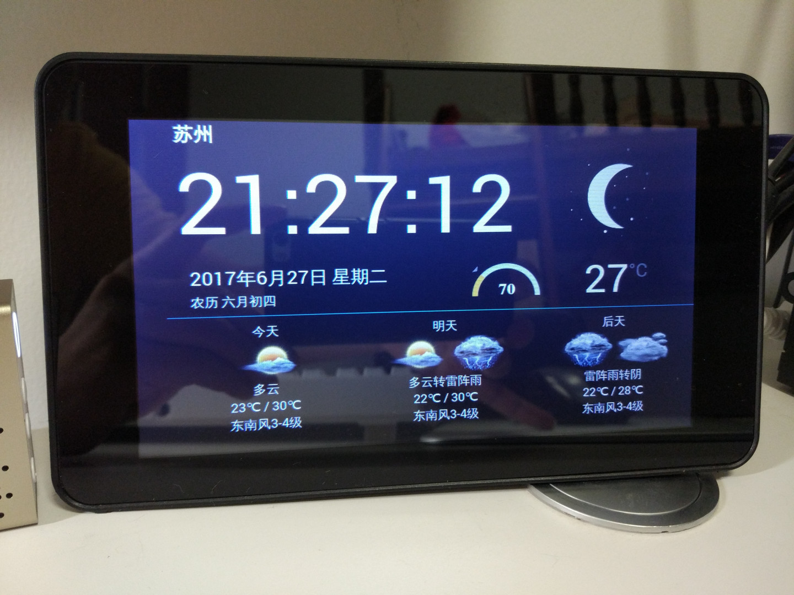

# 基于树莓派的时钟和天气预报

一款基于树莓派以及官方屏幕的时钟和天气预报。静态网页，基于webkit的浏览器都可以打开，但屏幕仅适配于官方7寸屏，实时天气数据来源于和风天气

## 使用方法

1. [和风天气](https://www.heweather.com/)申请账号获得key
2. 修改`static/js/clockweather.js`分别填入key和城市名
3. 浏览器打开index.html

## API调用

和风天气API：

https://www.heweather.com/documents/api/v5/weather
